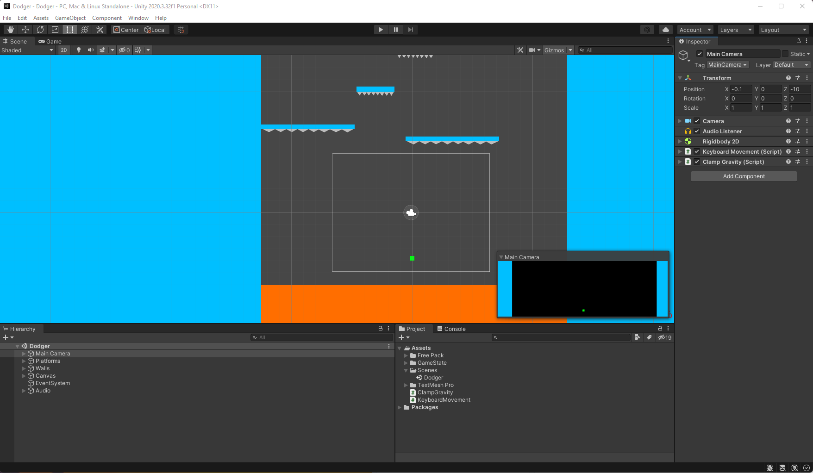

# Dodger

 My first 2d video game in Unity.
 
## Object of Game

The object of the game is to survive until you reach the exit. Spiked platforms are charging at you as you try and dodge your demise.

## Features

- Move player with A (left) and D (right)
- Restart level when the player collides with a spike
- Complete a level when the player collides with the exit
- Implmentation of Finite State Machine. See: [Assets/GameState](Assets/GameState)
- Audio: Background music, spike collision, and exit collision

## Purpose

I wanted to get familiar with the Unity Game Engine, Unity UI, and the general process for creating games within Unity. I follow a simple process, shown in this video.

## My process for learning Unity.

[I learned the process from Mark Brown.](https://www.youtube.com/watch?v=vFjXKOXdgGo&list=PLc38fcMFcV_uH3OK4sTa4bf-UXGk2NW2n&index=2)

1. Learn the [absolute basics about Unity](https://www.youtube.com/watch?v=E6A4WvsDeLE) and the [same for C#](https://www.youtube.com/watch?v=IFayQioG71A&list=PLzDRvYVwl53t2GGC4rV_AmH7vSvSqjVmz).
2. Reimplement [existing games](https://www.youtube.com/c/Zigurous/videos) (also check out the [list game genres](https://en.wikipedia.org/wiki/List_of_video_game_genres) for inspiration) to solidify Unity concepts. Rinse and Repeat. Side note, I'm not following the tutorial immediately. I wait until having watch all or most before I try to do it from memory. The video can always be referenced as needed, it's not cheating. The point is to try and make the knowledge my own by sincere practice.
3. Once, I've reimplemented enough games, I'll build my own game.
